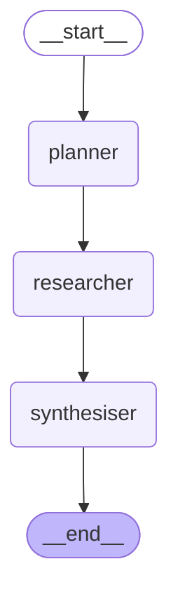

```mermaid
---
config:
  flowchart:
    curve: linear
---
graph TD;
	__start__([<p>__start__</p>]):::first
	planner(planner)
	researcher(researcher)
	synthesiser(synthesiser)
	__end__([<p>__end__</p>]):::last
	__start__ --> planner;
	planner --> researcher;
	researcher --> synthesiser;
	synthesiser --> __end__;
	classDef default fill:#f2f0ff,line-height:1.2
	classDef first fill-opacity:0
	classDef last fill:#bfb6fc
```

This diagram is auto-generated by LangGraph's `compile().get_graph().draw_mermaid()` method on the actual compiled graph object — it's not a hand-drawn picture, it's the real topology.
